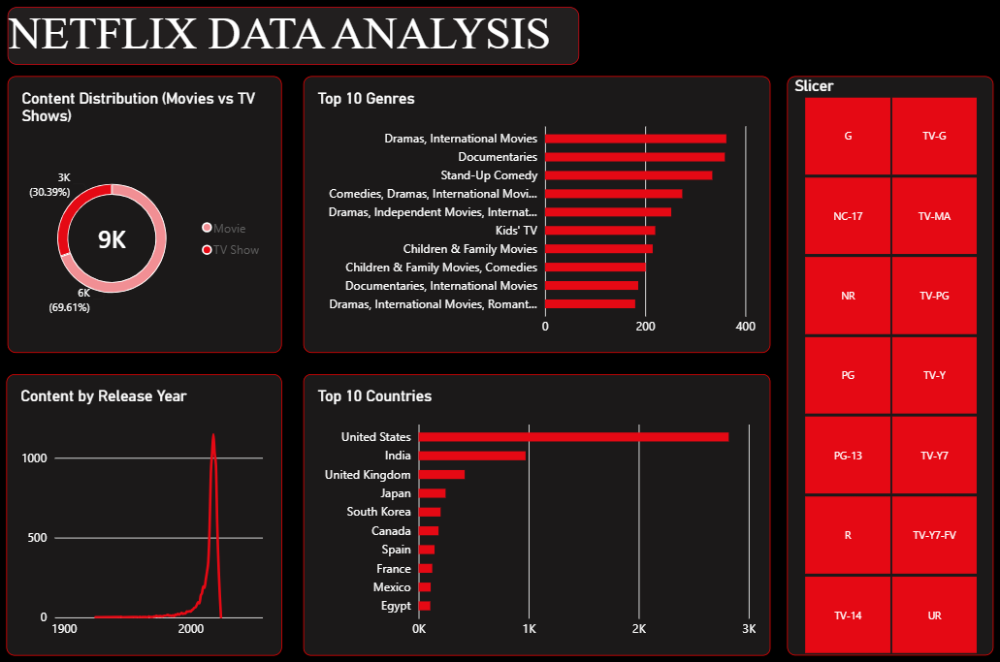

# netflix-data-analysis
# 🎬 Netflix Data Analysis | End-to-End Data Analytics Project

I finished my next end-to-end project from cleaning raw data to giving business solutions. My goal was analyzing global Netflix data, finding regional production differences, genre distribution, and audience segmentation.

---

## 📊 Dashboard Overview

---

## 🛠️ Technologies Used and Steps

* **Google BigQuery (SQL):** Calculated rating percentages and duration metrics using `CASE WHEN`, `COUNTIF`, `SAFE_CAST`, and subqueries.
* **Power BI:** Data cleaning (ETL), creating DAX metrics, and designing a Dark UI dashboard in Netflix brand style.
* **Data Storytelling:** Creating business recommendations from data and visual insights.

---

## 💡 Main Business Results

* **Content Balance:** Although movies are dominant in the portfolio (62.5%), Netflix should focus more on TV Shows to increase user retention.
* **Audience Mismatch:** In the US market, TV-14 category has too many documentaries, but TV-14 audience mostly prefers Drama and Comedy.
* **Local Expansion:** In markets like India and the UK, increasing local Stand-Up and documentary projects for TV-MA audience can bring more market share.

---

## 📁 Repository Structure
* `netflix_analysis.sql` — SQL scripts containing BigQuery analytical queries.
* `dashboard.png` — Power BI Dark UI dashboard view.

---
*Your feedback and suggestions are very valuable to me!*
